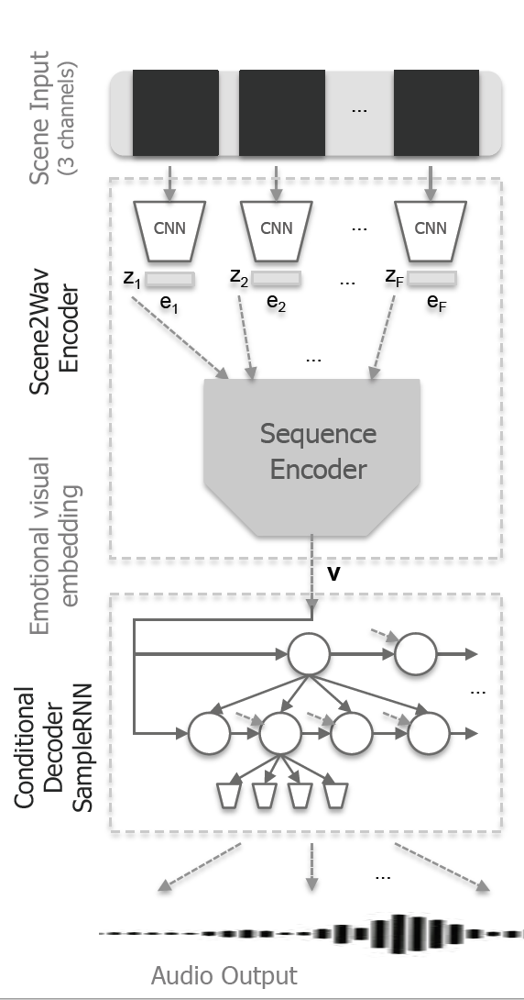

# Scene2Wav
* A PyTorch implementation of [*"Scene2Wav: A Deep Convolutional Sequence-to-Conditional SampleRNN for Emotional Scene Musicalization"*](http://link.springer.com/article/10.1007/s11042-020-09636-5) (MTAP 2020)
* Model has 3 stages: visual feature extraction with CNN, visual feature encoding with Deep RNN Encoder and music generation with Scene2Wav decoder (conditional SampleRNN Decoder).
<p align="center">

</p>

### Contents
[Requirements](#requirements) • [How to Use](#how-to-use) • [Results](#results) • [How to Cite](#acknowledgement)

## Requirements
This code was tested with Python 3.5+ and PyTorch 0.4.1 (or 0.4.1.post2)

The rest of the dependencies can be installed with `pip install -r requirements.txt`.

## How to Use
### 0. Dataset and Pre-Processing
* Data:
    * [Download pre-processed `data.npz`](https://data.mendeley.com/datasets/dsynj2sxnc/draft?a=35a88183-11cd-4a13-87ee-c9cabf9e7f86)
    * OR Make it from scratch:
        1. Download the [COGNIMUSE dataset](http://cognimuse.cs.ntua.gr/database)
        2. Organize it and pre-process following instructions in [AnnotatedMV-PreProcessing](https://github.com/gcunhase/AnnotatedMV-PreProcessing) 
* The `.npz` dataset should be copied in a subfolder in a `datasets/` folder in the root of the repository
    
        .Scene2Wav
        +-- datasets
        |   +-- data_npz
        |       +-- my_data_train.npz
        |       +-- my_data_test.npz
        |   +-- custom_data_npz
        |       > Your custom `npz` dataset can go in here


### 1. Training
* Training Scene2Wav using [pre-trained encoder](https://tinyurl.com/y8rkkw4z): run `train.py` with settable hyperparemeters.
```
CUDA_VISIBLE_DEVICES=0 python train.py --exp TEST --frame_sizes 16 4 --n_rnn 2 --dataset data_npz --npz_filename video_feats_HSL_10fps_3secs_intAudio_pad_train.npz --npz_filename_test video_feats_HSL_10fps_3secs_pad_test.npz --cnn_pretrain cnnseq/cnn4_3secs_res_vanilla_HSL_bin_1D_CrossEntropy_ep_40_bs_30_lr_0.001_we_0.0001_asgd/ --cnn_seq2seq_pretrain cnnseq/cnnseq2seq4_3secs_HSL_bin_1D_res_stepPred_8_ep_20_bs_30_relu_layers_2_size_128_lr_0.001_we_1e-05_adam_asgdCNN_trainSize_3182_testSize_1139_cost_audio/
```

* If you need to train encoder Scene2Wav with custom dataset (instead of using pre-trained one):
    * Pre-train CNN with Scene frames and Emotion scores
    ```bash
    python CNN_main.py --mode=train
    ```
    * Pre-train CNN-Seq2Seq end-to-end with the Scene frames and Audio
    ```bash
    python CNNSeq2Seq_main.py --mode=train
    ```

### 2. Generating Samples
Generate target, and baseline (CNNSeq2Seq) and ours (Scene2Wav)
```bash
python generate_audio_scene2wav.py
```
> Path to checkpoint, emotion, and number of samples to generate are set inside the script

### 3. Evaluation
* Emotion evaluation
    1. Install requirements
    ```bash
    pip install music21 vamp librosa midiutil
    ```
    2. [Melodia plugin](https://www.upf.edu/web/mtg/melodia)
        * [Download](https://docs.google.com/forms/d/e/1FAIpQLScAWn0xrRgSsMIacBZEv2sFnqnlHBDVe1bSxnrMB6E6lV_ykw/viewform)
        * Install:
            * MacOS: copy all files in `MTG-MELODIA 1.0 (OSX universal).zip` to: `/Library/Audio/Plug-Ins/Vamp`
            * Linux: copy all files in `MTG-MELODIA 1.0 (Linux 32/64-bit).zip` to: `/usr/local/lib/vamp`
    3. Transform wav to midi and detect chords
    ```bash
    python emotion_evaluation.py --data_dir [data dirname] --infile [filename].wav --outfile [filename].mid
    ```

* Human evaluation: Amazon MTurk

* [Perceptual audio metric](https://github.com/pranaymanocha/PerceptualAudio)
    1. [Clone code](https://github.com/pranaymanocha/PerceptualAudio) and install requirements
    2. Copy `perceptual_audio_metric.sh` to `metric_code/` and run
        > P.S: Modify audio path and filenames you wish to compare

## Results
* Results saved in `results/`: *training log*, *loss plots*, *model checkpoints* and *generated samples*.

* You can check some generated samples in [`results_generated_samples/`](./results_generated_samples/) (tested with VLC Media Player).

## Acknowledgement
In case you wish to use this code, please credit this repository or send me an email with any requests or questions.  
```
@article{sergio2020jmta,
    author={Sergio, G. C. and Lee, M.},
    title={Scene2Wav: A Deep Convolutional Sequence-to-Conditional SampleRNN for Emotional Scene Musicalization},
    journal={Multimedia Tools and Applications},
    year={2020},
    pages={1--20},
    doi={10.1007/s11042-020-09636-5},
    issn={1573-7721},
    volume={2020}
}
```

Please also cite the pre-processing repository [AnnotatedMV-PreProcessing](https://github.com/gcunhase/AnnotatedMV-PreProcessing) as:
```
@software{gwena_cunha_2020_3910918,
  author       = {Gwenaelle Cunha Sergio},
  title        = {{gcunhase/AnnotatedMV-PreProcessing: Pre-Processing 
                   of Annotated Music Video Corpora (COGNIMUSE and
                   DEAP)}},
  month        = jun,
  year         = 2020,
  publisher    = {Zenodo},
  version      = {v2.0},
  doi          = {10.5281/zenodo.3910918},
  url          = {https://doi.org/10.5281/zenodo.3910918}
}
```

If you use the [COGNIMUSE database](http://cognimuse.cs.ntua.gr/database):
```
@article{zlatintsi2017cognimuse,
  title={COGNIMUSE: A multimodal video database annotated with saliency, events, semantics and emotion with application to summarization},
  author={Zlatintsi, Athanasia and Koutras, Petros and Evangelopoulos, Georgios and Malandrakis, Nikolaos and Efthymiou, Niki and Pastra, Katerina and Potamianos, Alexandros and Maragos, Petros},
  journal={EURASIP Journal on Image and Video Processing},
  volume={2017},
  number={1},
  pages={54},
  year={2017},
  publisher={Springer}
}
```

If you use the [DEAP database](https://www.eecs.qmul.ac.uk/mmv/datasets/deap/index.html):
```
@article{koelstra2011deap,
  title={Deap: A database for emotion analysis; using physiological signals},
  author={Koelstra, Sander and Muhl, Christian and Soleymani, Mohammad and Lee, Jong-Seok and Yazdani, Ashkan and Ebrahimi, Touradj and Pun, Thierry and Nijholt, Anton and Patras, Ioannis},
  journal={IEEE transactions on affective computing},
  volume={3},
  number={1},
  pages={18--31},
  year={2011},
  publisher={IEEE}
}
```

Code based on deepsound-project's [PyTorch's implementation of SampleRNN](https://github.com/deepsound-project/samplernn-pytorch)
